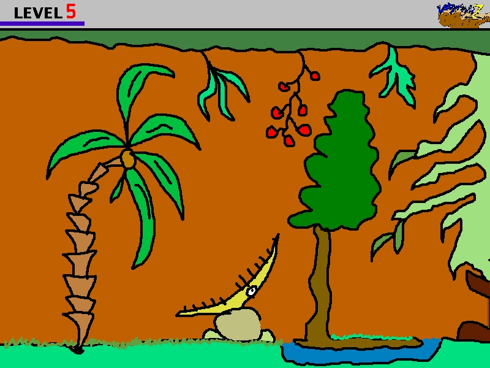

Labyrinthz
==========

A simple maze browser game written using [Phaser](http://github.com/photonstorm/phaser).

[Live Demo](http://eclectide.com/labyrinthz/)

More info at [eclectide.com](http://www.eclectide.com/blog/2014/11/05/labyrinthz/)

## License

Copyright 2014 Darek Kay <darekkay@eclectide.com>  

This project and its contents are open source under the [MIT license](LICENSE.txt).

